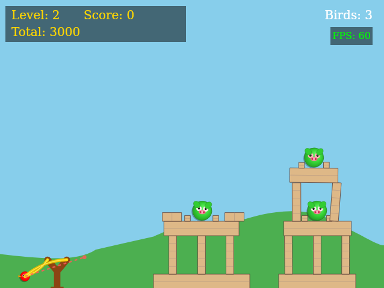

# Angry Tirds

A physics-based game inspired by Angry Birds, built with JavaScript and the [Box2D](https://box2d.org/) physics engine (via [WebAssembly port](https://github.com/Birch-san/box2d-wasm)).



## Features

- [Box2D physics engine](https://box2d.org/) integration via [WebAssembly port](https://github.com/Birch-san/box2d-wasm) with threaded task system
- Canvas-based rendering with dynamic visual effects
- Gamepad and keyboard controls with frame-rate independent movement
- Sound effects using Web Audio API
- Advanced pig damage system with visual feedback
- Performance monitoring with FPS counter
- Multiple challenging levels with physics-based puzzles
- Score tracking with level completion bonuses
- Integration with [JSGameLauncher](https://github.com/monteslu/jsgamelauncher)

## Getting Started

1. Install dependencies
```bash
npm install
```

2. Start development server
```bash
npm run dev
```

3. Build for production
```bash
npm run build
```

4. Preview production build
```bash
npm run preview
```

## Game Controls

- **Arrow Keys / D-Pad**: Move bird during aiming
- **Left Analog Stick**: Precise control during aiming (if using gamepad)
- **A Button / Z Key**: Hold to aim and pull back the slingshot, release to fire
- **Start Button / Enter**: Restart the game when game over
- **Select Button**: Skip to next level (development mode)

## Gameplay Features

- **Enhanced Aiming System**: Frame-rate independent aiming with wide angle range
- **Cumulative Damage System**: Pigs take damage based on impact speed, with visual feedback
- **Slingshot Physics**: Launch trajectory varies based on pull angle and position
- **Realistic Collisions**: Accurate physics simulation with custom material properties
- **Visual Feedback**: Damaged pigs change appearance, dead pigs are marked with X's
- **Score System**: Points for destroying pigs plus bonuses for level completion and unused birds

## Code Structure

The game is built with a modular architecture:

- `src/` - JavaScript source files
  - `main.js` - Main entry point and game initialization
  - `physics.js` - Box2D physics setup and world management
  - `entities.js` - Entity creation and property management
  - `gameController.js` - Game state, input, and physics logic
  - `gameRenderer.js` - Canvas rendering and visual effects
  - `levels.js` - Level design and configuration
  - `utils.js` - Helper functions and utilities

## Technical Details

- **Box2D Wasm**: [Box2D](https://box2d.org/) (version 3) compiled to WebAssembly through [box2d-wasm](https://github.com/Birch-san/box2d-wasm) with multi-threading support
- **Physics Optimization**: 
  - 4 substeps per frame for accurate collision
  - Bullet mode for fast-moving objects
  - Custom material properties for different objects
- **Rendering System**:
  - Canvas-based rendering with dynamic visual effects
  - No debug drawing - custom renderer for better visuals
  - Element tracking using uniqueIds for reliable identification
- **Entity Management**:
  - Centralized entity tracking with unique IDs
  - Safe memory management with validation checks
  - Properties for visual/physics synchronization
- **Performance**:
  - FPS monitoring and throttling
  - Optimized rendering with minimal redraws
  - Memory leak prevention with proper cleanup

## Integration

The game is designed to work in browser or with [JSGameLauncher](https://github.com/monteslu/jsgamelauncher) for easy integration into game collections. JSGameLauncher provides a compatibility layer for running games without a web browser.

## License

Copyright 2025 Luis Montes. Licensed under the MIT License.